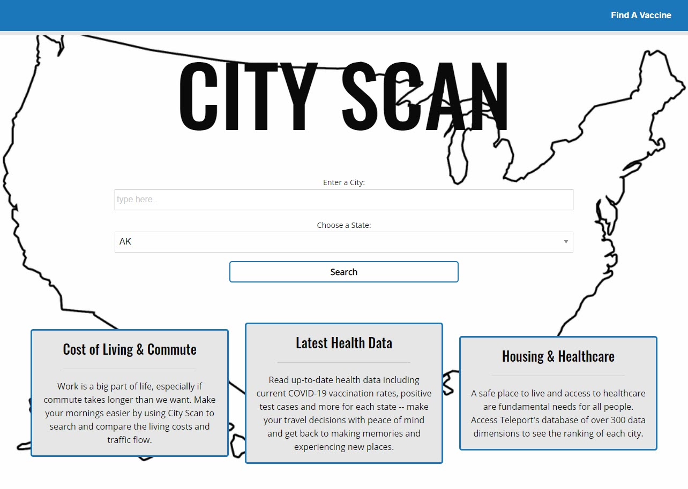
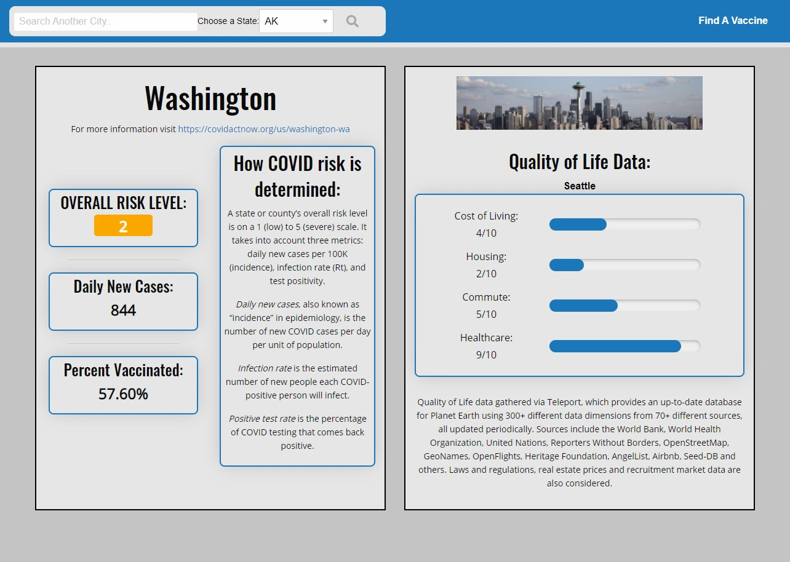

# City-Scan

## Description

We built this app because most people are beginning to travel again after COVID. Some people may be relocating due to changes in work environments or planning to visit. Many states are reopening with various travel restrictions, mask mandates and more - we wanted to create a resource for users to check on the current risk level and other factors that are important when traveling.

We built this project to create a single-source of information. With so many different resources available, it's hard to know what information is reliable. City-Scan is an easy-to-use source of information for both state and city level health and quality of life data.

## Usage

City-Scan was developed with an easy user interface. The landing page presents the user with an input field: "Enter a City," and a dropdown-menu: "Choose a State." Upon hitting the "Search" button, they are redirected to a results page with the populated information with the state's COVID data on one side and the city's quality of life data on the other. A search bar is at the top of the results page to search again along with a link to find the closest vaccine.

[City Scan](https://michaelhermes.github.io/City-Scan/)

## Credits

City-Scan pulls data from the following APIs:

- [Teleport API](https://developers.teleport.org/)
- [CovidActNow API](https://covidactnow.org/data-api)

Contributors to City-Scan:

- Michael Hermes | [Github Profile](https://github.com/MichaelHermes)
- Krista Bienia | [Github Profile](https://github.com/kjnb-0)
- Ron Shutter | [Github Profile](https://github.com/Proton-8)
- Evan Arbour | [Github Profile](https://github.com/evanarbour)
